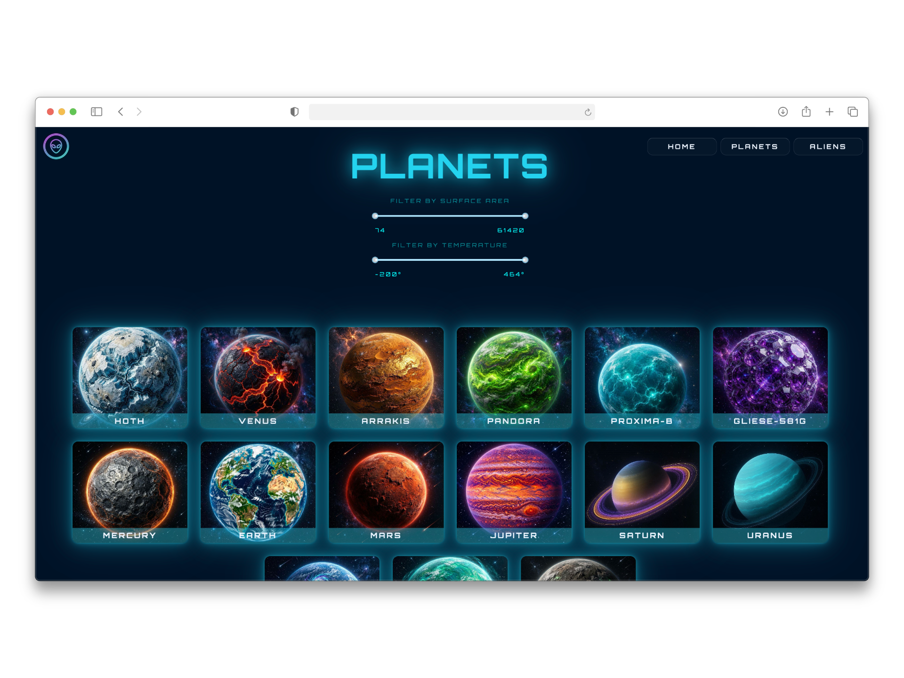
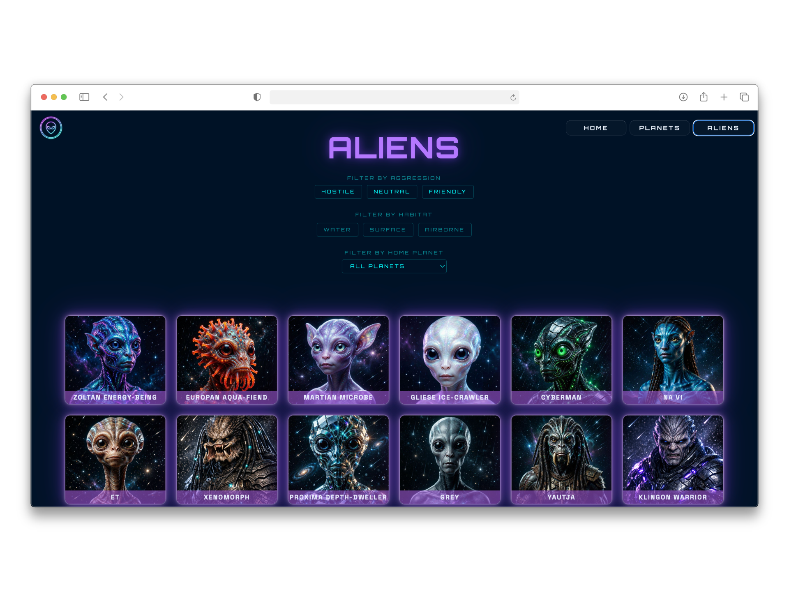
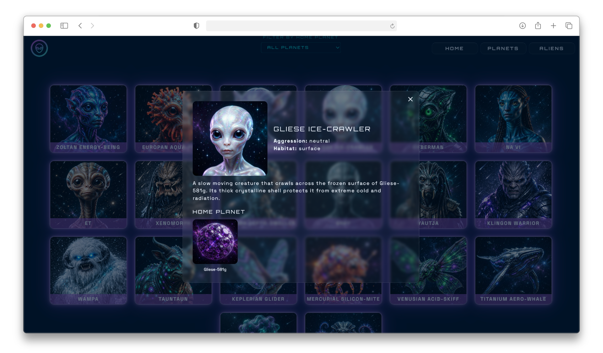
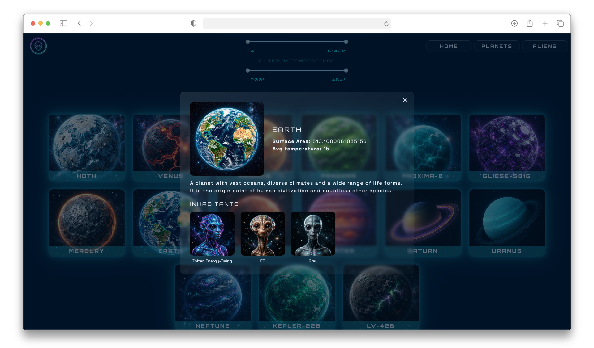

# AlienPlanet

[Visit our live app!](https://alien-planet.onrender.com/)

A fullstack app for exploring aliens and the planets they inhabit! Each alien has a home planet, each planet can host several species of aliens.

This project is built as part of a course in agile development within the Frontend Developer program at the higher vocational education Yrkeshögskolan Borås. The purpose was to simulate working as an agile team. We planned and ran sprints, held standups, sprint reviews and retrospectives and incrementally delivered our MVP. The agile process was the main focus, rather than the product itself. Feel free to take a look at our process documentation in the folder "logg".

## Endpoints

[Visit our API!](https://alienplanet.onrender.com/api/)

| Route | What it returns |
|-------|-----------------|
| `GET /api/aliens/<id>/image` | PNG image file of the alien |
| `GET /api/planets/<id>/image` | PNG image file of the planet |
| `GET /api/planets/<id>` | Always an array. The planet matching the id; if no id is given, all planets are returned |
| `GET /api/aliens/<id>` | Always an array. The alien matching the id; if no id is given, all aliens are returned |
| `GET /api/aliens/search?aggression=<value>` | Array of all aliens with a matching aggression |
| `GET /api/planets/<id>/aliens` | Array of the aliens that live on a given planet |
| `GET /api/planets?min_temp=<min>&max_temp=<max>` | Array of planets with a temperature within the given range |
| `GET /api/aliens?aggression=<xxx>` | Array of aliens with a given aggression |
| `GET /api/aliens?habitat=<xxx>` | Array of aliens with a given habitat |
| `GET /api/aliens?habitat=<xxx>&aggression=<xxx>` | Array of aliens with a given habitat AND a given aggression |

## Tech stack

**Frontend**

- **React 19** with the React Compiler
- **TypeScript**
- **Vite** (dev server, build, HMR)
- **React Router v7** for client-side routing
- **Tailwind CSS v4** (via `@tailwindcss/vite`)
- **react-icons** for iconography
- **rc-slider** for range/filter controls
- **ESLint** (typescript-eslint, react-hooks, react-refresh)

**Backend**

- **Node.js** with **Express 5**
- **TypeScript** (strict mode)
- **MySQL** via **mysql2** (hosted on Aiven)
- **CORS** middleware
- **dotenv** for environment configuration
- **tsx** for development (watch mode)
- Layered architecture: routes → controllers → services → repositories → models

**Database**

- MySQL (hosted on [Aiven](https://aiven.io/))
- Seeded via script

**Deployment**

- Frontend & backend on [Render](https://render.com/)
- Database on Aiven

**Tooling & workflow**

- GitHub Projects (Kanban board, issues, sub-issues)
- Branch-per-issue + pull request reviews
- Figma (design system & wireframes, FigJam for agile process artifacts)
