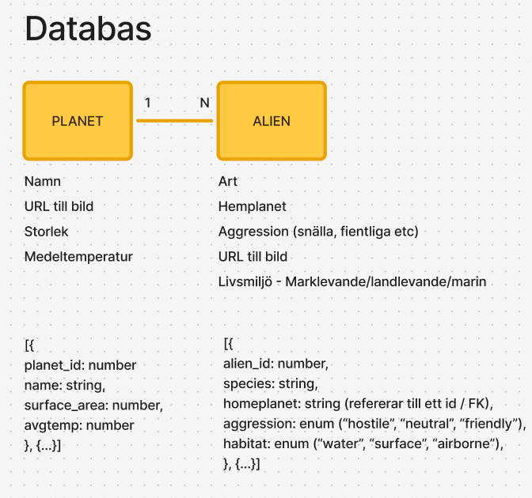
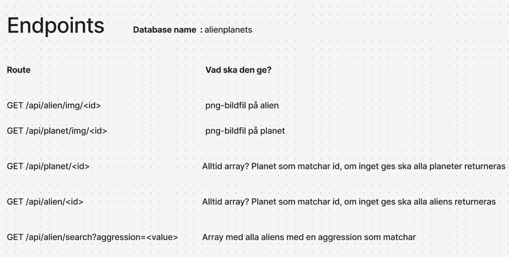
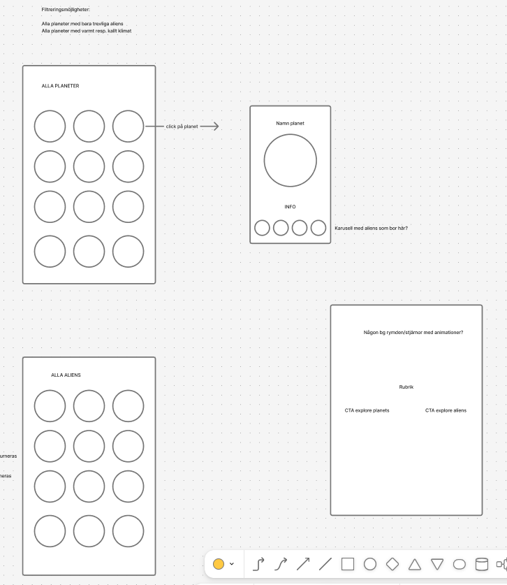
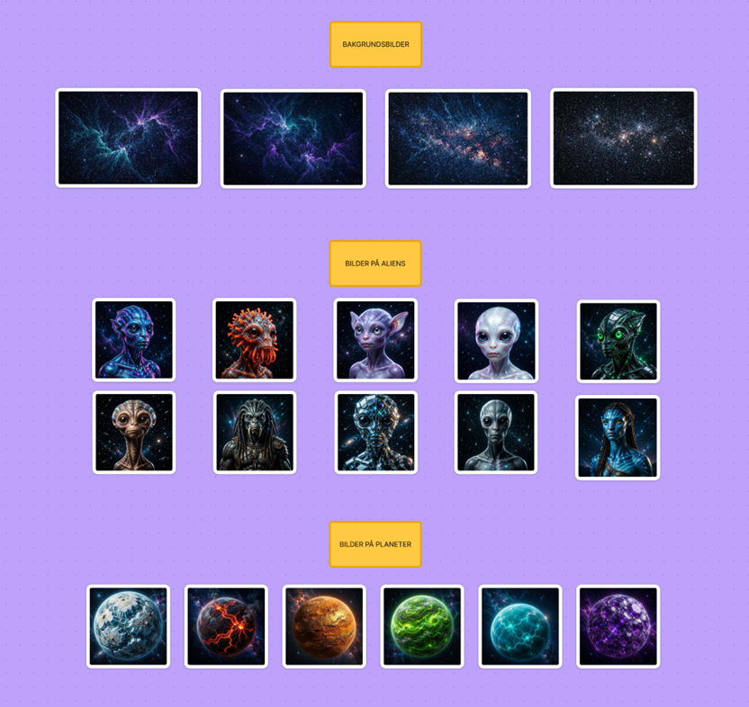
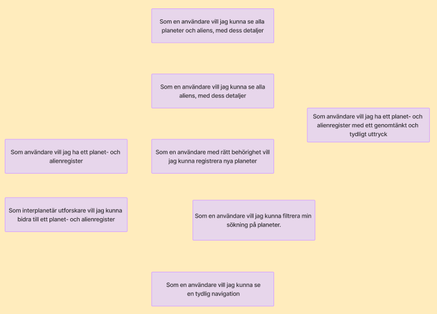
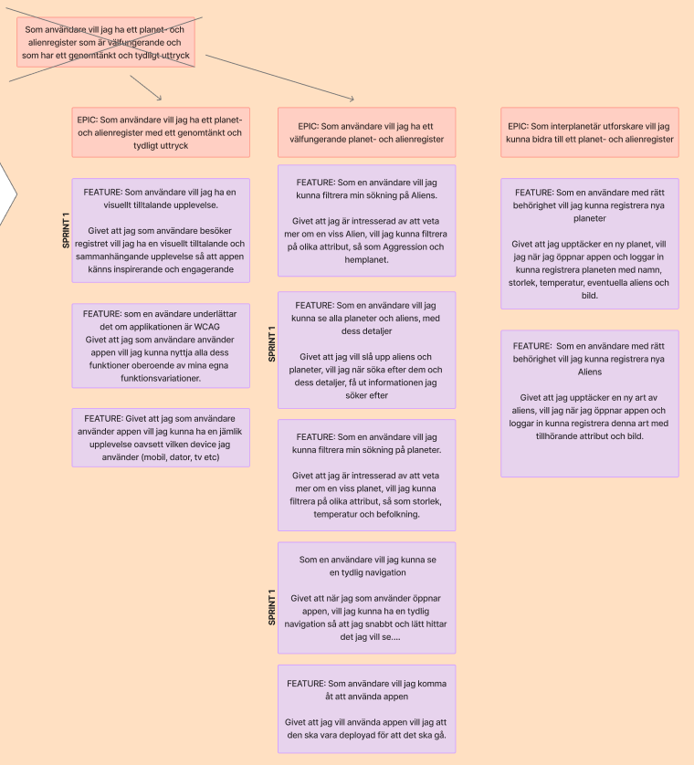
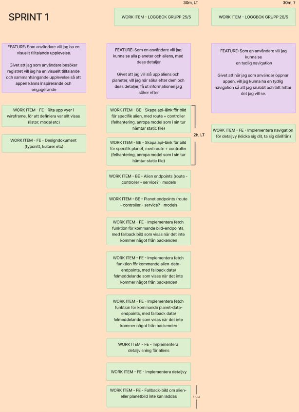
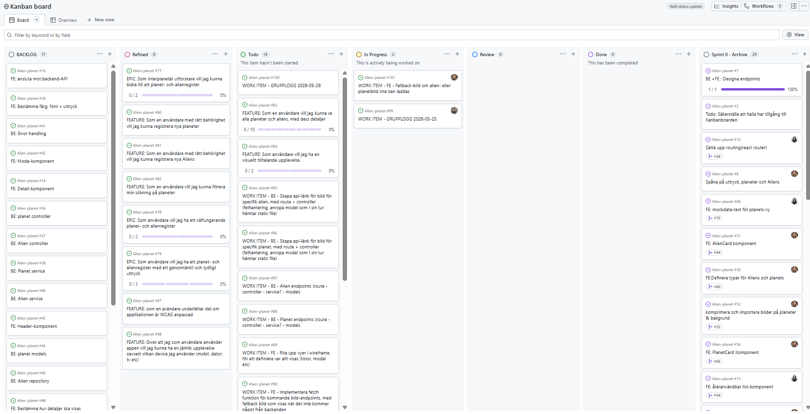

# AlienPlanet loggbok

Kunskapsdomän: Aliens har en hemplanet. En planet kan ha flera alien-typer.

## 2026-05-19 Uppstart

### FÖRMIDDAG

#### Frontend, UX

##### Primärt ansvar:

- Rebecka
- Lisette
- Emelie

##### Stack:

- React
- TypeScript
- Tailwind

#### Backend, DB

##### Primärt ansvar:

- Mattias
- Linnéa

##### Stack:

- MySQL
- Node
- Express

✅ Ansvarsområden  
✅ Stack  
✅ Initierat repo med "project"

### EFTERMIDDAG

Enkel DB-design  


Första utkast endpoints  


Skiss för att undersöka vad appen ska kunna göra  


### Issues Done

✅ Frontend Routing installerad / Basic setup
✅ Frontend mappstruktur
✅komprimera och importera bilder på aliens

### Code hygien

- Branch baserat på issue

✅ Dependencies installerade
✅ Mappstruktur på plats
✅ Script för seeding av DB

## 2026-05-20

### Agilt arbete

- Vi har definerat mer vad varje kolumn betyder och innebär

### DAGENS AGENDA

Mattias

- Göra klart seeding bugs (2 h)
  Admin server för att stoppa initsiering av pool före databasen finns
- Seed ändring (5 min)
  Seed skapade fortfarande planet_image column för planet table, tog bort det
- App.js (30 min)

- Routes
  (30 min)

Lisette

✅ Generera planeter ( 30 min)

✅ Generera bakgrundsbilder ( 30 min )



✅ Definera typer för Aliens och Planeter (30 min)

✅ Bygga AlienCard -kompontet (30 min)

✅ Bygga PlanetCard -kompontet (10 min)

Rebecka

✅ Bygga återanvändbar listkompontet (2 h)

✅ Angett Planets-vyn mockdata för att testa List & PlanetCard-component

✅ Angett Aliens-vyn mockdata för att testa List & AlienCard-component

Linnéa (mestadels frånvarande 20/5)

✅ Code reviews gjorda under dagen och i efterhand 21/5

✅ Query function export från config/db.js (i efterhand 21/5)

✅ Alien + Aggression types (i efterhand 21/5)

✅ Alien models: All aliens, alien by id, aliens by aggression (i efterhand 21/5)

## 2026-05-25

### Avslut sprint 0 med retrospektiv, 10:00 - 11:00

#### Vad har vi gjort hittills (summering)

**Agilt**

- Gått från lösare work items till lite mer nyanserade punkter
- Formatering work items (med märkning, BE resp FE)
- Börjat tänka i issues / sub issues
- Skrivit bra logg, och delat på ansvaret för loggeriet

**Frontend**

- Återanvändbar list-komponent
- Card-komponenter till Aliens och Planets
- Interfaces för Aliens och Planets
- UI-styling startsida
- Navigering
- Temporär mockdata för test
- Routing
- Bilder för Aliens och Planets

**Backend**

- Layered architecture mappstruktur implementerad
  ```
  backend/
  ├── dist/
  ├── public/
  │   └── images/
  │        ├── Aliens/
  │        ├── Background/
  │        └── Planets/
  └── src/
      ├── app.ts
      ├── server.ts
      ├── config/
      ├── controller/
      ├── middleware/
      ├── models/
      ├── repositories/
      ├── routes/
      ├── seed/
      ├── services/
      ├── types/
      └── utils/
  ```
- Databaskonfiguration och queryexport
- Seeding med två tabeller (aliens, planets), script för att köra seed
- Server + App
- Typer för aliens + aggression

#### Vad funkar bra som vi vill fortsätta med?

- Tidsestimering! Bra träning och bra för projektet

- Feature based mappstruktur i frontend pga liten app

- Branch kopplat till issue! Mycket blir automatiserat, flödet blir tydligt. 

- Github projects, och kopplingen till repot

- Märkning FE/BE/Alla → Tydlighet direkt i översikten

- När vi kommunicerar. Viktigt att alla är insatta i hela projektet, oavsett vad man jobbar med. 

- Gruppen har parerat bra för frånvaro, mycket agilt.

- Löpande pull requests och reviews

- Vissa samtal kan föras i respektive mindre arbetsgrupp, för att hålla samtalet relevant för alla i den “stora kanalen”

#### Vad ska vi sluta göra?

- Springa för snabbt. Det är frestande att bara jobba på, men vi påminner oss om fokus för kursen och prioriterar momenten som har med agil projektmetodik att göra.

- Tomma work items (skriv en beskrivning av vad den ska åstadkomma, sedan räcker det bra i kombination med självförklarande kod i PR)

#### Vad skulle vi kunna testa att göra?

- Bli bättre på att jämföra faktisk nedlagd tid med tidsestimat, för utvärdering och lärdom  
  _Reflektion: Om man estimerar rätt är det ett kvitto på att man verkligen har förstått uppgiften och sin egna förmåga_

- Jobba mer med labels
- Efterlikna funktionaliteten i DevOps genom att manuellt skriva om det är Epic/Feature/Work item, i rubriken innan FE/BE osv i kombination med funktionen sub issues
- Stående punkt på standup: Dema FE/BE, förklara kod etc.
- I work items: Skriv en beskrivning av vad den ska åstadkomma, sedan räcker det bra i kombination med självförklarande kod i PR
- En gruppmedlem assignas per dag för att sköta “gruppdelen” av loggen, koppla till en work item i kanbanboarden för tydlighet

#### Vad ska vi göra härnäst?

- Bryta ut möten för beslutspunkter (behövs t.ex. för att spika appens uttryck)
- Formalisera en sprintplanering
- Träna på features, epics, work items
- Omsätta alla punkter vi har hittat i retro-mötet i vårt vidare arbete

### Workshop - Epics & Features 11:15-11:30



### Sprintplanering 11:30-11:50, 13:00-14:00



Reflektion - Det är hårt jobb att planera! Det vore lättare för stundent att bara sätta sig och koda.



Epics, features och de work items som hör till pågående sprint förs in i vårt board på github projects.  
Items från sprint 0 arkiveras i ett dedikerat board.

Backlog: Random unrefined items  
Refined: Har bearbetats i grupp, och ska göras men inte innevarande sprint  
Todo: Aktuella för pågående sprint  
In progress: Någon har ansvaret för work item:et, och arbete pågår  
Review: Pull review inskickad  
Done: Reviewat, mergeat och färdigt jobb från innevarande sprint  
Sprint# - Arkiv för respektive sprint



### Dagens jobb

Mattias:
✅ Alien GET endpoint (est 2h, faktiskt 1h 45m)
✅ Planet GET endpoint (est 1h faktiskt 30m)
✅ Gemensamt script för back- och frontend (est 2h, faktiskt 2h 30m) (inkluderande spike) 

Linnéa:  
✅ Skapat templates för våra möten i fig-jam  
✅ Grupplogg (est 30m, faktisk tid 45m)  
✅ Skapa api-länk för bild för specifik planet, med route + controller (felhantering, anropa model som i sin tur hämtar static file)  
✅ Skapa api-länk för bild för specifik planet, med route + controller (felhantering, anropa model som i sin tur hämtar static file)  
(Est sammanlagt 2h för bildpunkterna, faktisk tid ca 2h)

Lisette:  
✅ - Genererat två fallback bilder ifall Alien- eller Planet bild inte kan laddas.  
✅ - Impleterat fallbavk om backend inte kan leverera en bild ska ett placeholder-kort visas.
AlienCard visar en alien-placeholder och PlanetCard visar en planet-placeholder via onError på img-taggen. (1 h för båda punkter)  

Rebecka:  
✅ - Implementerat fetch-funktion i api.ts för att hämta alla Aliens med felhantering. Skapade även custom hook useAliens som hämtar api-svaret och sparar i state samt error-state för felhantering. (1 1/2h ca) 

Emelie:  
✅ - Länkat ihop sidor med knappar och navbar i App.tsx for now.  
✅ - Satte upp en basic styling med Tailwind.  

## 2026-05-26

*MATTIAS LOGGAR IDAG*

### Dagens jobb
Mattias:  
✅ -

Linnéa (glömde både att estimera tid samt att kolla hur lång tid det tog):  
✅ - Skapat templates för möten i fig-jam  
✅ - Uppdaterat seed data för att motsvara redan genererade bilder  
✅ - Promptat fram nya bilder för återstående planeter och aliens enligt tidigare etablerad process, för att ha något att visa i appen  
✅ - Middleware för error hantering + refaktorisera 404 till eget middleware  

Lisette:  
✅ - Haft möte med frontend hela förmiddagen gällande design  
✅ - Skapat dsignsystem  
✅ - Gjort wireframes/protoyper  


Rebecka:  
✅ - Frontendmöte halva dagen för att gemensamt få fram designdokument  
✅ - Styling av navbar och implementerade loggan  
✅ - Försökte testköra endpoints för aliens, fungerar inte än - fortsättning nästa vecka  

Emelie:  
✅ - Frontendmöte på förmiddagen för att få fram ett designdokument  
✅ - Lade in bestämda typsnitt och färger i vårt projekt och stylade med dessa.  
✅ - Byggde en statisk modal för att öppna detaljvyn för Aliens och Planets.  


# Standup 2026-05-25 09:00-ca 10-00

## Lisette

### Har
* Fetch-funktion för Aliens

### Ska
* Frontendmöte
* få fram designsystem

### Hinder
* Noll

## Emelie

### Har
* Fixat lite med Tailwind
* lagt in basic färger och layout som kommer att ändras.
* Kopplat ihop våra sidor med knappar och navbar.

### Ska
* Frontendmöte och få fram designsystem

### Hinder
* Inget

## Mattias

### Har
* Gjort klart Alien endpoint

### Ska
* Göra klart Planet endpoint, merg:a PR
* eve bugfixes eller error handling

### Hinder
* Inga hinder

## Linnéa

### Har
* Skrivit grupplogg för 25/5
* implementerat endpoint för alienbild
* implementerat endpoint för planetbild

### Ska
* Ska evt lägga tid på bugfix i samband med att vi mergear
* synka seed data med bilder, komplettera data m beskrivn.
* prompta fram fler bilder för att komplettera data
* Error handling middleware.

### Hinder
* Privata omständigheter

### Har
* Genererat Fallback bilder
* lagt till dem om alien- eller planetbild inte kan laddas

### Ska
*  Sitta med Frontend och göra ett design system och wireframes
* skriva loggboik

### Hinder
* Har möte på eftermiddagen och kommer inte vara tillgänglig efter kl 13

## Rebecka

# Sprint 1 review

## Ticket review

### CORS
Snabbt och smidigt, men fungerar ej i nuläget

### Error handling middlware
Mer detaljerad error handling, sepparat för dev miljö

### Logga och styling av navbar
Gick bra, inga hinder

### Planets och Aliens endpoints
Gick bra, liten spike för att kolla upp folder struktur

### Synka mock data med bilder
Uppdaterade bilder för att matcha alien namn och standardisera bildnamn.

### API länk för bild till planeter och aliens
Fungerar bra, CORS fortfarande blockar 

### Fetch funktion
Hemtar i nuläget mockdata, CORS behöver lösas innan databasen kan användas

### Fallback bild frontend
Fungerar och visas korrekt

### Wireframe och prototyp klar i figma
Disign dokument: https://www.figma.com/design/ZElW0NcOJJRJVzpnBP0aUw/Alien-Planets-design?node-id=0-1&p=f&t=UEFGNnc8yYIbCEIz-0

### Startup script för hela appen
NPM install i både frontend och backend, seed, och starta både frontend och backend server sammtidigt

### Kvar
90 fetch funktion för bildendpoint osv
CORS issues


### Agilt
* Grupp log
* Strukturera våra möten
* Uppdelning i mindre grupper FE/BE
* Kanban arbete med Epic - Feature - Wi
* Interna möten i arbetsgrupper
* Gemensam planering genom daily standups
* Tidsestimering

### 2 stars and a wish 

# Mattias:
* ⭐ Gruppen hanterar github projects jättebra, bra struktur
* ⭐ Frånvaro kommuniceras och sköts på ett snyggt sätt, vi kan planera runt det
* 🌈 Issues i rätt kolumn
  
# Emelie
* ⭐ Bra kommunikation i gruppen
* ⭐ Bra struktur på projektet, tydlighet
* 🌈 Tydligheten kunde vara bättre avseende beslut, information har skett i flera kanaler
  
# Rebecka
* ⭐ Gruppens kommunikation 
funkar jättebra
* ⭐ Högt i tak och förlåtande 
miljö att lära sig i och “göra fel”
* 🌈Gillar inte att lämna projekt halv klara, önskar att det fanns tid att göra klart.
  
# Linnéa
* ⭐ Arbetsgrupperna funkar bra, 
effektivt med olika roller/ansvar
* ⭐ Stjärna till frontend för snygg design :D
* 🌈 Kom ihåg att uppdatera kanban board med assignee och status
  
# Lisette
* ⭐ Roligt att alla delar med sig av sina kunskaper och bidrar till gemensamt lärande
* ⭐ Samarbetet i gruppen
* 🌈 Vore skönt att kunna fokusera helt på detta projektet i en avgränsad tidsrymd, svårt att switcha mellan detta och fördjupning

# Vad fungerar bra som vi ska fortsätta med

* Ha högt i tak
* Kommunicera
* Gott samarbete
* Epics/Features/work items - både planeringen och omsatt i kanban board
* Interna samtal och arbetsgrupper (FE och BE team)
* Bra balans mellan att sitta i grupp och ha möten och att jobba enskillt och koda

# Vad ska vi sluta göra?
* Jobba utan att fixa work item i kanban (rätt kolumn, assignee) board


# Vad skulle vi kunna testa? (eller fortsätta testa)
* Estimera tiden en ticker tar och gemföra med hur långt det faktiskt tog
*  Timeboxa möten, sätt av en tid flr slut och respektera den

# Vad ska vi göra härnäst?

* Se åvan
* Planera sprint 2 på tisdag :D

  ## 2026-06-02

  ### Sprint 2 planering 9-9.30 ,(paus för lektion) Sen satt vi igen 10.15 - 11.30

*LISETTE LOGGAR IDAG*
* Vi inledde dagen med att gå igenom eftersläp från föregående sprint. 
* Därefter bröt vi ner features i konkreta work items.
* Efter en lektionspaus städade vi upp backloggen, vilket var behövligt.
* När work items var klara gick vi över till tidsestimering och fördelning. 
Vi märker att FE bär en tyngre last i slutet – backend planerar att avlasta.

### Dagens jobb

**Mattias:**

**Lisette:**
- ✅ Sprint 2 planering på förmiddagen  
- ✅ Suttit med frontend och gjort några slutgiltliga designbeslut  
- ✅ Stylast Listan för att visa Aliens och Planets  
- ✅ Stylat AlienCard och PlanetCard  

**Rebecka:**
**Emelie:**
**Linnea:**
